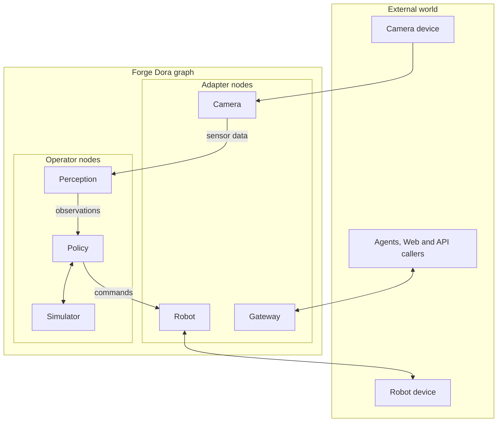

# Forge

Forge is a small robotics framework core for Dora dataflows. It provides shared
message schemas, Python and Rust message implementations, reusable node runner
helpers for robot drivers and policy nodes, and typed tool endpoint contracts.

This repository intentionally focuses on the framework layer:

- `interfaces/forge_msgs/` contains the canonical message schema.
- `interfaces/forge_tool/` contains the Tool documentation index, architecture, and
  language-neutral Wire Protocol.
- `packages/msgs` provides Python message models and Arrow serialization.
- `crates/forge_msgs` provides the Rust message implementation.
- `cpp/forge_msgs` provides the C++ message implementation.
- `packages/robot` provides robot driver protocols, safety clipping helpers, and
  a standard Dora Adapter node loop.
- `cpp/forge_robot` provides the C++ robot driver interfaces, safety helpers,
  and optional Dora C++ Adapter runner.
- `packages/policy` provides policy implementation protocols and a standard Dora
  Operator node loop.
- `packages/tool` provides dependency-free ToolEndpoint SPI and logical Wire models,
  with embedded Query and Action handling; Session dispatch remains future work.
- `packages/common` and `crates/forge_common` provide shared utilities,
  currently including logging and tracing helpers.
- `packages/kinematics` provides optional Pinocchio-based URDF forward
  kinematics, geometric Jacobians, and deterministic damped-least-squares IK.

Robot-specific drivers and hardware SDK integrations should live in downstream
packages, for example a separate `forge_robots` repository.

## Status

Forge tracks six independently versioned package families: Common, Msgs, Robot,
Policy, Kinematics, and Tool. Current releases are Common `1.0.1`, Msgs `1.2.0`, Robot
`1.0.1`, Policy `1.0.1`, Kinematics `1.0.1`, and Tool `0.1.0`. Implementations of one
family across Python, Rust, C++, and the language-neutral interface remain synchronized;
unrelated families may release at different rates.

Each release is identified by a protected family tag such as
`forge-msgs-v1.2.0`; Tool releases use `forge-tool-v<semver>`. Historical generic tags
such as `v1.0.0` belong to an earlier repository layout and do not identify these
releases.

The initial family releases define stable contracts for message schemas,
serialization, shared utilities, kinematics, and robot/policy runners. Each
family's `1.x` line remains backward compatible; breaking that family contract
requires its next major version. See
[`CHANGELOG.md`](CHANGELOG.md) for the release baselines and
[`RELEASING.md`](RELEASING.md) for package-family boundaries, protected GitLab
tags, and validation procedures.

Forge ToolEndpoint v1alpha1 is the first tagged/public Tool contract and is released as
Tool `0.1.0` with its carrier in Msgs `1.2.0`. Compatible deployments must use matching
Gateway and provider revisions. Earlier untagged prototypes are incompatible, and mixed
deployments are not supported as backward compatible.

## Tool documentation

Start with [`interfaces/forge_tool/README.md`](interfaces/forge_tool/README.md). It links
the architecture, normative Wire protocol, Python package guide, and canonical Arrow
schema without duplicating their contracts.

## Repository Layout

```text
forge/
├── interfaces/forge_msgs/      # Canonical cross-language message schema
├── interfaces/forge_tool/      # Tool architecture and Wire Protocol
├── packages/common/            # Python shared utilities
├── packages/kinematics/        # Python Pinocchio FK/Jacobian/IK library
├── packages/msgs/              # Python message models and Arrow conversion
├── packages/policy/            # Python policy node protocols and Dora runner
├── packages/robot/             # Python robot driver protocols and Dora runner
├── packages/tool/              # Python ToolEndpoint API and logical protocol
├── crates/forge_common/        # Rust shared utilities
├── crates/forge_msgs/          # Rust message types and Arrow conversion
├── cpp/forge_common/           # C++ shared utilities
├── cpp/forge_msgs/             # C++ message types and Arrow conversion
├── cpp/forge_robot/            # C++ robot driver helpers and Dora runner
├── versions.toml               # Package-family release versions
├── pyproject.toml              # Virtual Python uv workspace
└── Cargo.toml                  # Rust cargo workspace
```

## Requirements

- Python 3.12 or newer for the workspace
- Rust toolchain with edition 2024 support
- A C++20-capable compiler and CMake 3.20 or newer for C++ packages;
  `cpp/forge_msgs` and its dependents require C++20
- Apache Arrow C++ for `cpp/forge_msgs`
- Rust/Cargo and network access, or a local Dora `v0.4.1` checkout, for the
  optional C++ `forge_robot` Dora runner
- [`uv`](https://docs.astral.sh/uv/) for Python dependency management
- Dora runtime when running real nodes (`dora-rs==0.4.1` is used by the Python
  node packages)

## Installation

Clone the repository and install the default Python workspace:

```bash
uv sync --dev
```

Install every workspace package, including Tool and the optional Pinocchio
kinematics library, when developing or running the complete Python test suite:

```bash
uv sync --all-packages --all-extras --dev
```

Build the Rust workspace:

```bash
cargo build --workspace
```

Published package names differ only where crates.io ownership requires it:

| Family | PyPI distribution | crates.io distribution | Import/library name |
|---|---|---|---|
| Common | `forge-common` | `forgelab_common` | `forge_common` |
| Msgs | `forge-msgs` | `forge_msgs` | `forge_msgs` |

Build the C++ `forge_msgs` library:

```bash
cmake -S cpp/forge_msgs -B cpp/forge_msgs/build
cmake --build cpp/forge_msgs/build
```

Build the C++ `forge_common` library:

```bash
cmake -S cpp/forge_common -B cpp/forge_common/build
cmake --build cpp/forge_common/build
```

Build the C++ `forge_robot` library without the Dora runner:

```bash
cmake -S cpp/forge_robot -B cpp/forge_robot/build
cmake --build cpp/forge_robot/build
```

Build and compile-link validate the C++ `forge_robot` Dora runner against Dora
`v0.4.1`:

```bash
cmake -S cpp/forge_robot -B cpp/forge_robot/build-dora \
  -DFORGE_ROBOT_CPP_WITH_DORA=ON \
  -DFORGE_ROBOT_CPP_BUILD_TESTS=ON
cmake --build cpp/forge_robot/build-dora --target forge_robot_dora_runner_compile
```

The C++ Dora API headers are generated by Dora's CXX bridge. By default,
`cpp/forge_robot` clones `https://github.com/dora-rs/dora.git` at tag
`v0.4.1`; it does not use Dora `main`. To use a local Dora `v0.4.1` checkout:

```bash
git clone --branch v0.4.1 https://github.com/dora-rs/dora.git /path/to/dora-v0.4.1
cmake -S cpp/forge_robot -B cpp/forge_robot/build-dora \
  -DFORGE_ROBOT_CPP_WITH_DORA=ON \
  -DDORA_ROOT_DIR=/path/to/dora-v0.4.1
cmake --build cpp/forge_robot/build-dora --target forge_robot_dora_runner_compile
```

Use C++ `forge_msgs` from a Git URL in another CMake project:

```cmake
include(FetchContent)

FetchContent_Declare(
  forge
  GIT_REPOSITORY https://gitlab.ex-ai.cn/PhyAgentOS/framework/forge.git
  GIT_TAG forge-msgs-v1.2.0
  SOURCE_SUBDIR cpp/forge_msgs
)
FetchContent_MakeAvailable(forge)

target_link_libraries(my_app PRIVATE forge_msgs::forge_msgs)
```

The C++ library requires Apache Arrow C++. If `ArrowConfig.cmake` is not
available, the CMake project can also use the Arrow headers and libraries
provided by an installed `pyarrow` package.

Use C++ `forge_common` from a Git URL in another CMake project:

```cmake
include(FetchContent)

FetchContent_Declare(
  forge_common
  GIT_REPOSITORY https://gitlab.ex-ai.cn/PhyAgentOS/framework/forge.git
  GIT_TAG forge-common-v1.0.1
  SOURCE_SUBDIR cpp/forge_common
)
FetchContent_MakeAvailable(forge_common)

target_link_libraries(my_app PRIVATE forge_common::forge_common)
```

`cpp/forge_common` uses only the C++ standard library. Its logging helpers read
the same `FORGE_LOG_LEVEL`, `FORGE_LOG_FILE`, `FORGE_LOG_CONSOLE`, and
`FORGE_LOG_STREAM` environment variables as the Python package.

Use C++ `forge_robot` from a Git URL in another CMake project:

```cmake
include(FetchContent)

FetchContent_Declare(
  forge_robot
  GIT_REPOSITORY https://gitlab.ex-ai.cn/PhyAgentOS/framework/forge.git
  GIT_TAG forge-robot-v1.0.1
  SOURCE_SUBDIR cpp/forge_robot
)
FetchContent_MakeAvailable(forge_robot)

target_link_libraries(my_robot_node PRIVATE forge_robot::forge_robot)
```

`cpp/forge_robot` reuses `cpp/forge_msgs` and `cpp/forge_common`. The driver
interfaces, clipping helpers, and Arrow validation build without Dora headers;
`RunDoraRobotNode` is compiled only when `FORGE_ROBOT_CPP_WITH_DORA=ON`.

Downstream C++ robot packages should link `forge_robot::forge_robot` and include
the public umbrella header:

```cpp
#include <forge_robot/forge_robot.hpp>
```

For packages that only implement driver logic, safety clipping, or Arrow
validation, keep `FORGE_ROBOT_CPP_WITH_DORA` off. To compile a Dora runner in the
downstream package, enable the option at configure time and either let CMake
download Dora `v0.4.1` or point `DORA_ROOT_DIR` at a local Dora `v0.4.1`
checkout:

```bash
cmake -S . -B build \
  -DFORGE_ROBOT_CPP_WITH_DORA=ON \
  -DDORA_ROOT_DIR=/path/to/dora-v0.4.1
```

## Testing

Verify that every Python, Rust, and C++ implementation matches its package
family version in `versions.toml`, including the Msgs interface major and lock
files:

```bash
python scripts/check_release_versions.py
```

Run the Python tests:

```bash
uv run pytest packages/msgs/tests packages/policy/tests packages/robot/tests packages/kinematics/tests packages/tool/tests
```

Run the Rust tests:

```bash
cargo test --workspace --locked
```

Build and verify release archives before creating a Git tag:

```bash
uv run python scripts/build_python_distributions.py
cargo package --workspace --locked
```

By default, the Python build script creates local validation artifacts for all
six packages. It starts from a clean `dist/release/python` directory, verifies
wheel and sdist identity, Apache-2.0 metadata and exact license layout, runs the
additional Kinematics checks, and writes `dist/release/python/SHA256SUMS`.
These all-family artifacts are not a publishing command.

Build a publishable candidate for one family only from a clean commit:

```bash
uv run python scripts/build_python_distributions.py --release-family msgs
```

Local release-family mode rejects dirty trees and requires the expected protected
tag not to exist. A family tag CI run selects that family automatically and
requires its tag to exist and point to the checked-out `HEAD`.

Run the C++ tests:

```bash
ctest --test-dir cpp/forge_msgs/build
ctest --test-dir cpp/forge_common/build
ctest --test-dir cpp/forge_robot/build
```

Run Ruff checks:

```bash
uv run ruff check .
```

## Message Schema

The canonical cross-language contract starts at
`interfaces/forge_msgs/forge_msgs.v1.yaml`, which references `common.v1.yaml`,
`control.v1.yaml`, `motion.v1.yaml`, `geometry.v1.yaml`, `interaction.v1.yaml`,
`perception.v1.yaml`, `sensor.v1.yaml`, and `tool.v1.yaml`. Python, Rust, and C++
implementations should conform to those schemas. See
`interfaces/forge_msgs/SCHEMA.md` and `packages/msgs/README.md` for message
semantics and Arrow encoding details.

Core messages include:

- `JointState` for robot or simulator joint observations
- `JointCommand` for low-level joint commands
- `LocomotionCommand` for planar body-frame velocity commands
- `Image` and `CompressedImage` for camera payloads
- `PointCloud` for organized and unorganized XYZ data
- 2D/3D detections and instance masks
- `Pose`, `PolicyCommand`, and policy status/control messages
- `ToolMessage` for Forge ToolEndpoint protocol transport

`ToolMessage` is the exact single-row Arrow carrier for ToolEndpoint Wire messages.
Its canonical column order, types, nullability, and generic validation live in
[`interfaces/forge_msgs/tool.v1.yaml`](interfaces/forge_msgs/tool.v1.yaml); logical
payload semantics live in the
[ToolEndpoint protocol](interfaces/forge_tool/PROTOCOL.md). `payload_json` contains only
the logical payload object, and message-specific validation remains in `forge-tool`.
Python, Rust, and C++ implementations exist, with bidirectional Python/C++ Arrow IPC
coverage.

## Forge Node Model

Every deployed Forge Dora node is classified by its primary responsibility as one of two
categories:

| Category | Responsibility | Typical examples |
| --- | --- | --- |
| **Operator** | Performs Forge-native computation inside the graph; its primary boundary is Forge messages. | Policy, perception, planner, controller, simulator. |
| **Adapter** | Owns communication with an external device, service, runtime, or caller and translates its protocol/lifecycle into Forge messages. | Robot, camera, Gateway, storage or cloud connector. |



Classification follows the node's primary ownership boundary, not message direction or
whether it performs local computation. The diagram illustrates ownership boundaries,
not allowed topology: either category may exchange Forge messages with either category.
External Agents, applications, devices, and services are outside this node taxonomy; a
Forge Adapter owns their boundary. A simulator is an Operator because its world model is
internal computation. Gateway is an Adapter because it owns external caller and routing
boundaries.

`ToolEndpoint` is orthogonal to this classification: either an Operator or Adapter may
expose Query, Action, or Session capabilities. It does not create a third node category.
See the [Tool architecture](interfaces/forge_tool/ARCHITECTURE.md) for the control-plane
overlay.

Some implementation interfaces retain names such as `PolicyAdapter`. That name describes
a plug-in hosted inside a policy Operator node; it does not classify the node itself as
an Adapter.

### Standard runners

`forge-robot` and `cpp/forge_robot` use fixed input and output names for standard Robot
Adapter nodes:

- input `tick` publishes output `state`
- input `action` or `action/<source>` accepts a sparse low-level `JointCommand`; namespaced inputs allow disjoint arm and gripper streams, while overlapping command sources require explicit arbitration
- input `master_state` mirrors a leader `JointState` to a position command
- input `locomotion_command` accepts a `LocomotionCommand` when the driver supports
  locomotion

`forge-policy` provides the standard Policy Operator runner. It hosts a policy
implementation (currently exposed through the `PolicyAdapter` Python protocol) and
handles ticks, proprioceptive state, image caching, and policy lifecycle commands so
algorithm code can focus on inference and command generation.

## Configuration

Logging can be configured with environment variables:

- `FORGE_LOG_LEVEL`: `DEBUG`, `INFO`, `WARNING`, `ERROR`, or `CRITICAL`
- `FORGE_LOG_FILE`: optional path for file logging
- `FORGE_LOG_CONSOLE`: `true` or `false`
- `FORGE_LOG_STREAM`: `stdout` or `stderr`

See `.env.example` for a non-secret example.

## Contributing

See `CONTRIBUTING.md` for development setup and contribution guidelines. Please
report security issues using the process in `SECURITY.md`.

## License

Forge is licensed under the Apache License, Version 2.0. See `LICENSE` for
details.
