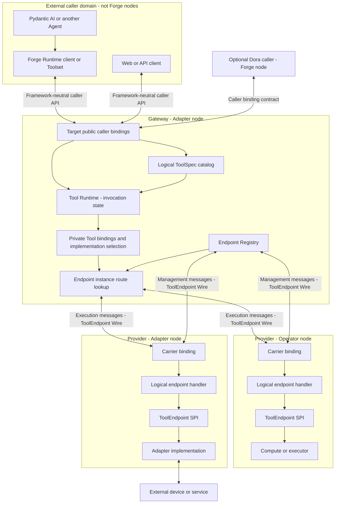

# Forge Tool architecture

This document explains the stable design boundaries around Forge Tool. It is not a
field-by-field protocol specification, implementation status page, or roadmap.

- The repository-wide node taxonomy is summarized in the
  [Forge node model](../../README.md#forge-node-model).
- Wire requirements belong to [`PROTOCOL.md`](PROTOCOL.md).
- Python usage and current package restrictions belong to the
  [`forge-tool` package guide](../../packages/tool/README.md).
- Gateway, Runtime, and provider rollouts belong to those components' repositories and
  issue trackers.

## 1. Design in one view

Forge Tool follows six architectural rules:

1. Every deployed Forge Dora node is classified by its primary responsibility as an
   **Operator** or an **Adapter**.
2. External Agents, applications, devices, and services are outside that node taxonomy;
   an Adapter owns each boundary into Forge.
3. `ToolEndpoint` is a capability that either node category may expose; it is not a third
   node category.
4. Gateway is an Adapter node. It owns caller transport boundaries and provider routing.
5. Tool Runtime is a logical domain responsibility, normally hosted by Gateway; it is not
   itself a Wire protocol or mandatory standalone node.
6. Tool messages form a low-rate control plane. High-rate robotics data stays on the Dora
   data plane.

## 2. Node roles used by Tool

The root [Forge node model](../../README.md#forge-node-model) is the single definition of
Operator and Adapter. Tool architecture only adds these consequences:

- A Pydantic AI Agent, Web application, or other external caller is not a Forge node and
  is therefore neither an Operator nor an Adapter.
- Gateway is an Adapter because it owns caller transport and routing boundaries.
- A provider may be an Operator or Adapter; the same ToolEndpoint contract applies.
- Tool Runtime is a logical domain responsibility. If split into a standalone
  internal-only Dora node, that node is an Operator.
- `ToolEndpoint` is an exposed capability, not a node or third category.

`PolicyAdapter` remains the name of a Python algorithm plug-in hosted by a policy
Operator. It does not change the node's category.

## 3. Tool control-plane architecture



The diagram shows the **target** caller boundary and the stable provider boundary:

- **External callers** own Agent runs, conversations, model-specific tool definitions, and
  framework correlation such as a Pydantic AI `tool_call_id`. Those concepts do not cross
  the provider Wire.
- **Gateway Adapter** accepts framework-neutral caller traffic and routes provider
  exchanges. A Pydantic-specific Toolset belongs in the external Agent/client, not in
  Gateway or `forge-tool`.
- **ToolSpec catalog** defines stable logical caller capabilities and schemas independently
  of transient endpoint leases. A private Tool binding maps a logical Tool to candidate
  endpoint operations; the binding is not exposed to callers.
- **Tool Runtime domain** owns caller-visible invocation state, selects an implementation,
  and creates `attempt_id`.
- **Gateway Registry/router** maps the selected `endpoint_id` to the current
  `endpoint_instance_id` and physical carrier route. It owns dynamic availability, not
  Tool definitions or implementation selection.
- **Provider node** may be an Operator or Adapter. It embeds the same carrier binding,
  logical handler, and ToolEndpoint SPI in either case.
- **Execution Wire** is bidirectional after caller semantics and implementation selection.
- **Management Wire** is bidirectional between providers and Registry and does not depend
  on a caller invocation or provider selection.

The current experimental Gateway Query bridge is endpoint-oriented and does not implement
the target ToolSpec catalog, implementation resolver, caller-visible post-completion
invocation state, or stable caller identity contract. Its bounded in-flight ledger only
correlates pending Query exchanges. The bridge validates provider discovery/routing
integration; it is not the caller boundary depicted above.

`ToolEndpoint Wire` is an edge contract in the diagram, not a deployed component.

There is no independent "Tool node" or mandatory "Endpoint Host" in this architecture.

## 4. Contract boundaries

### 4.1 Caller-facing Tool Runtime API

The target Runtime API is framework-neutral and serves external Agents, Web clients, and
optional Forge-node callers. Pydantic AI `ToolDefinition`, deferred-run, approval, and
error classes are client-side projections and are not part of this API. The Runtime owns:

- authorized ToolSpec discovery;
- logical `invocation_id` creation;
- implementation selection and `attempt_id` creation;
- caller-visible status, result, control, and events;
- CompletionSpec evaluation;
- any future retry/fallback policy; and
- durable or retained invocation state when required.

A logical ToolSpec is independent of a provider registration and may remain defined while
no compatible endpoint is available. Catalog versioning is therefore distinct from the
process-local Endpoint Registry revision. Private Tool bindings and provider operation
selection remain inside Runtime/Gateway.

The Runtime hides endpoint routing identities and provider attempts. A caller provides a
logical Tool identity, arguments, timeout/deadline, and eventually an idempotency key. It
does not choose `endpoint_id`, provider `operation`, `endpoint_instance_id`, or
`attempt_id`. Trusted caller identity comes from the caller binding or authentication
context rather than an untrusted request field.

Tool Runtime is a logical responsibility, not a requirement to create another node or
process. Neither `forge-tool` nor the current experimental Gateway Query bridge implements
the complete stable Runtime API.

### 4.2 ToolEndpoint SPI and Wire

The provider boundary consists of:

- a language-level endpoint SPI implemented by provider business code; and
- the language-neutral ToolEndpoint Wire exchanged with the provider.

The Wire carries endpoint registration and one execution attempt's invoke, status,
result, control, event, or error messages. It is the internal bidirectional contract
between Runtime/Gateway and providers.

A logical endpoint handler binds each descriptor operation to one SPI implementation.
The Python implementation is `ToolEndpointHandler`. The provider embeds the handler
directly in its existing Operator or Adapter node.

### 4.3 Physical carrier

A carrier transports one logical envelope without changing its meaning. Dora uses
`forge_msgs.ToolMessage`, an exact single-row Arrow value. The carrier exposes routing
and correlation fields as columns and stores only the logical payload object in
`payload_json`.

`ToolMessage` validates the generic carrier shape. Message-specific payload validation
remains the responsibility of the ToolEndpoint logical protocol implementation.

## 5. Tool capability is orthogonal to node category

Both node categories may expose any Tool operation semantics when appropriate:

| Provider node | Typical Tool capability | Example |
| --- | --- | --- |
| Operator | Query | Read the latest perception result or compute a plan. |
| Operator | Action | Run a bounded internal computation with progress. |
| Operator | Session | Start and stop a policy or simulation session. |
| Adapter | Query | Read device capabilities or a cached sensor snapshot. |
| Adapter | Action | Execute and cancel a robot motion. |
| Adapter | Session | Start and stop a device stream or external service session. |

The category describes what boundary owns the work. Query, Action, and Session describe
how one operation behaves. Neither concept replaces the other.

## 6. One message family, three semantics

Query, Action, and Session are operation semantics declared by
`ToolOperationDescriptor`. They are not separate message families.

```text
Tool execution
├── tool.invoke.request / tool.invoke.response
├── tool.status.request / tool.status.response
├── tool.result.request / tool.result.response
├── tool.control.request / tool.control.response
├── tool.event
└── tool.error
```

The selected descriptor operation determines how the handler interprets
`tool.invoke.request`:

| Semantics | Provider behavior | Control model |
| --- | --- | --- |
| Query | Return an authoritative terminal `ToolResult` directly. | No status or control. |
| Action | Normally admit with `ToolAccepted`, then expose status/result/events; an initial terminal result is also valid. | Optional cancellation. |
| Session | Normally admit with `ToolAccepted`, then expose status/result/events; an initial terminal result is also valid. | Optional normal stop. |

A caller or transport does not redeclare semantics in a route or message type.

## 7. Control plane and data plane

Tool messages carry low-rate control and small JSON-compatible values. Images, joint
states, joint commands, trajectories, and other high-rate or large data continue to use
Forge messages on the Dora data plane.

```text
Camera Adapter ── Image/data plane ──> Perception or Policy Operator
Policy Operator ── JointCommand/data plane ──> Robot Adapter
Gateway Adapter ── ToolEndpoint control plane ──> either provider category
```

A Tool request should carry a compact argument or data reference, for example
`{"image_ref": "latest"}`, rather than embedding an image. Tool control may coordinate a
computation or device action, but it does not replace its streaming data path.

## 8. State ownership

Each kind of state has one authority.

| State | Authority | Typical placement |
| --- | --- | --- |
| Agent conversation, run state, and framework `tool_call_id` | External Agent | Outside the Forge node graph. |
| Logical Tool definitions and input/output schemas | Tool Runtime / ToolSpec repository | Usually a Gateway Adapter domain module. |
| Private Tool-to-endpoint bindings | Tool Runtime resolver | Gateway Adapter domain module or an internal Runtime Operator. |
| Logical invocation and caller-visible outcome | Tool Runtime | Usually Gateway Adapter domain module. |
| Attempt selection and retry/fallback policy | Tool Runtime | Not inferred from `ToolError.retryable`. |
| Current endpoint availability and route | Gateway Registry | Gateway Adapter. |
| Business execution status and result | Provider executor | Provider Operator or Adapter. |
| Logical event order and physical response/event publication | Embedded handler and transport binding | Inside the provider node. |
| High-rate sensor/command data | Dora data plane participants | Operators and Adapters that produce or consume it. |

The Python Action handler retains bounded private records for admission, response-first
early-event tuple ordering, terminal consistency, and duplicate suppression while a
record remains present. A transport binding owns the physical response-publication gate
for concurrent events. That ledger does not replace provider business state or Runtime
invocation state.

## 9. Provider embedding

A concrete provider owns:

- its Dora `Node` and input/output identifiers;
- its event loop and shutdown behavior;
- periodic endpoint registration when enabled;
- the business executor and any local handle mapping; and
- publication of Arrow values returned by, or passed to, the binding.

For an Operator, the executor is internal computation. For an Adapter, the executor also
owns translation to an external device/service lifecycle.

`DoraToolEndpointBinding` only converts bounded in-memory Arrow carriers, invokes the
transport-independent handler, and coordinates Action response/event publication. It
does not create a Dora node, call `asyncio.run()`, decode unbounded IPC bytes, select
routes, or manage Dora metadata.

Direct embedding is the primary integration boundary. A general runner may be a
convenience wrapper, but it is not a new node category and cannot be the only supported
deployment pattern.

## 10. Identity and lifecycle

Forge keeps exchange, execution, and route identity separate:

```text
request_id                       one request/response exchange
invocation_id                    one target-Runtime-owned logical invocation
attempt_id                       one target-Runtime-owned provider attempt
ToolExecutionKey                 invocation_id + attempt_id
endpoint_id                      stable logical provider identity
endpoint_instance_id             concrete provider process-start identity
```

An endpoint-local executor handle is private provider state. It never replaces
`ToolExecutionKey` on the Wire. These identifiers provide correlation, not replay,
idempotency, exactly-once execution, or automatic retry.

Architectural lifecycle meanings are also independent of node category:

- **accepted** means an asynchronous execution was admitted, not completed;
- **control accepted** means cancel/stop was admitted, not completed;
- **executor completed** describes provider execution, while Runtime still owns
  CompletionSpec evaluation;
- **unknown** is a terminal unrecoverable outcome, not a pending lookup; and
- a terminal result is authoritative, while events are incremental notifications.

The Wire protocol defines exact transition and terminal-result rules.

## 11. Registry and routing

Endpoint management uses the same Wire family:

```text
endpoint.register
endpoint.unregister
endpoint.registry.response
endpoint.status
```

A trusted configured Gateway route authorizes an `endpoint_id`. Message contents alone
do not grant registration authority. The Registry tracks at most one current process
instance for a configured endpoint and uses periodic registration as announce/upsert/
lease renewal.

The Registry owns availability only. It does not own provider execution state or evaluate
Runtime CompletionSpec. Provider category does not change registration semantics.

## 12. `PolicyCommand` coexistence

The existing `PolicyCommand` and `PolicyCommandStatus` paths remain independent. A policy
node is an Operator even though its package exposes a type named `PolicyAdapter`.

If a future project unifies policy control, both command ingress paths should call one
message-neutral Policy Controller. Direct Wire-to-Wire field translation is unsafe: a
legacy `PolicyCommandStatus.done` acknowledgement does not necessarily mean a complete
Tool Session has terminated.

## 13. Non-goals

The provider protocol does not itself provide:

- a third Tool-specific node category;
- Pydantic AI, MCP, A2A, or OpenAI tool compatibility;
- a public Web or Dora caller contract;
- persistent invocation storage;
- replay, exactly-once execution, or cross-process deduplication;
- automatic retry based on `retryable`;
- high-rate data transport; or
- mandatory use of a general endpoint runner.

Caller bindings enter through Tool Runtime semantics. Provider integrations preserve the
same SPI/Wire boundary whether the provider is an Operator or Adapter.

## 14. Versioning and deployment

`forge.tool.endpoint/v1alpha1` is the candidate contract for the first tagged/public
Tool release. Earlier untagged prototypes are not a compatibility baseline.

The first release is coordinated across the `forge-tool` logical package, Python/Rust/C++
`ToolMessage` bindings, Gateway behavior, and concrete providers. Mixed
prototype/current deployments are unsupported. Package-family release details belong to
[`../../RELEASING.md`](../../RELEASING.md).
